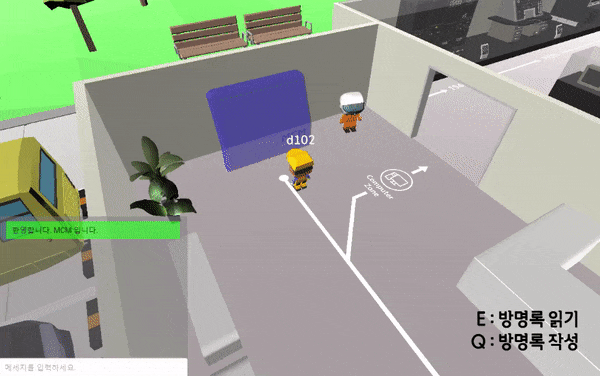
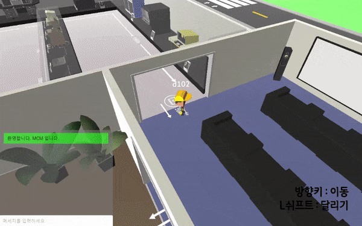

# MCM (Metaverse Computer Museum)
> 메타버스 컴퓨터 박물관

어른, 아이 할 것 없이 누구나 흥미를 느끼는 주제인 컴퓨터, 그 역사와 정보를 제공하여 교육적인 효과를 낼 수 있으며 메타버스 환경을 통해 다양한 컨텐츠를 재미있게 즐길 수 있는 메타버스 컴퓨터 박물관입니다.

## 주요기능

- Unity를 이용한 메타버스 구현
- 과거의 컴퓨터, 게임기 전시 (3D 모델, 전시품 정보 제공)
- 영상 시청 (UCC)
- 미니게임
- 음성 채팅
- 방명록

## 세부기능

|구분|기능|설명|비고|
|:---|:---|:---|:---|
|1|Unity를 이용한 메타버스 구현|WASD, 방향키로 이동 가능<br>활성화된 오브젝트와 'Q', 'E', 'R' 키로 상호작용 가능||
|2|방명록|방명록 오브젝트와 상호작용 시 방명록 작성 가능<br>다른 사용자의 방명록 조회 가능||
|3|과거의 컴퓨터, 게임기 전시|시대별로 다양한 컴퓨터, 게임기 전시<br>전시물 정보 조회 가능, 전시물 자세히 보기 가능||
|4|영상 시청|영상존의 소파 오브젝트와 상호작용 시 MCM의 UCC 시청 가능||
|5|미니게임|게임존의 게임기들과 상호작용 시 미니게임 플레이 가능<br>(테트리스, 베네치아, Pong, XYMouse)||
|6|음성 채팅|MCM에 입장하기 전 마이크 장치 선택<br>휴식존에 들어가면 자동으로 음성채널 입장||

## 아키텍처


## 유니티 WebGL 빌드

[유니티 저장소](https://github.com/ragu6963/MCM_Unity/tree/main)

위 링크의 프로젝트를 WebGL 로 빌드 후 빌드 파일들을 `frontend/public/unity` 에 복사

## 영상존 영상

`frontend/public/unity/StreamingAssets` 에 `testVideo.mp4` 이름으로 저장

## 사용 예시

1. MCM 접속 및 캐릭터 이동


2. 방명록 작성




3. 전시물 조회 및 자세히 보기


4. 영상 시청




5. 미니게임 플레이


6. 음성 채팅 (휴식존 입장 시 자동으로 음성채널 입장)


## 개발 설정

### Tools
```
Unity 2019.4.31f1
Spring boot
Java 8
Vue 2
```

### **1. 도커 설치**

``` bash
apt update & apt upgrade

# 필수 패키지 설치
sudo apt-get install apt-transport-https ca-certificates curl gnupg-agent software-properties-common

# GPG Key 인증
curl -fsSL https://download.docker.com/linux/ubuntu/gpg | sudo apt-key add -

# docker repository 등록
sudo add-apt-repository \
"deb [arch=amd64] https://download.docker.com/linux/ubuntu \
$(lsb_release -cs) \
stable"

# 도커 설치
sudo apt-get update && sudo apt-get install docker-ce docker-ce-cli containerd.io

# 도커 설치 확인
sudo docker -v

# reboot 했을 때 자동 실행
sudo systemctl enable docker && service docker start
```

- 일반 계정 도커 실행

``` bash
# 도커 그룹 생성
sudo groupadd docker

# 현재 계정 도커 그룹에 포함
sudo usermod -aG docker $USER

# 권한 열기
sudo chmod 666 /var/run/docker.sock

# 도커 재시작
sudo service docker restart
```

### **2. 데이터베이스**

- MySQL 컨테이너 생성

``` bash
docker run --name mysql-container -e MYSQL_ROOT_PASSWORD=ssafyD102! -d -p 3306:3306 mysql
```

- 데이터베이스 생성

``` bash
# 컨테이너 bash 진입
docker exec -it mysql-container bash

# mysql 접근
mysql -u root -p
# Password : ssafyD102!

# 데이터베이스 생성
CREATE DATABASE mcm CHARACTER SET = utf8mb4 COLLATE = utf8mb4_unicode_ci;
```

### **3. OpenVidu**

- 포트 열기

``` bash
22 TCP, 80 TCP, 443 TCP, 3478 TCP+UDP, 40000~57000 TCP+UDP, 57001~65535 TCP+UDP
```

- OpenVidu 설치

``` bash
cd /opt # openvidu는 /opt 에 설치하는 것을 권장

sudo curl https://s3-eu-west-1.amazonaws.com/aws.openvidu.io/install_openvidu_latest.sh | sudo bash
```

- 설정 파일 수정

``` bash
cd openvidu
sudo vim .env
```

``` bash
DOMAIN_OR_PUBLIC_IP=<도메인 주소>
OPENVIDU_SECRET=<비밀번호>
CERTIFICATE_TYPE=letsencrypt

# HTTP 연결 포트 
HTTP_PORT=8080

# HTTPS 연결 폰트
HTTPS_PORT=4443
```

- 명령어

``` bash
# 서버 실행
sudo ./openvidu start

# 서버 종료
sudo ./openvidu stop

# 서버 재실행
./openvidu restart
```


### **4. 프로젝트 배포**

- SSL 인증서 발급

``` bash
# letsencrypt 설치하기
$ sudo apt-get update
$ sudo apt-get install letsencrypt

# 인증서 발급
$ sudo letsencrypt certonly --standalone -d k5d102.p.ssafy.io

# SSL 이동
$ sudo cp /etc/letsencrypt/live/k5d102.p.ssafy.io/fullchain.pem /var/lib/docker/volumes
$ sudo cp /etc/letsencrypt/live/k5d102.p.ssafy.io/privkey.pem /var/lib/docker/volumes

# pem을 PKCS12 형식으로 변경
$ openssl pkcs12 -export -in fullchain.pem -inkey privkey.pem -out key.p12 -name airpageserver -CAfile chain.pem -caname root

# S05P31D102\backend\src\main\resources 경로에 key.p12 파일 저장
```

- 사용 Port

```
3000 : 웹소켓 서버
80   : 프론트엔드 HTTP 
443  : 프론트엔트 HTTPS
8443 : 백엔드
3306 : mysql
4443 : openVidu
```

- docker-compose 실행

``` bash
# root 경로
$ docker-compose up -d --build

# 컨테이너 및 이미지 삭제
$ docker-compose donw --rmi all
```

> Unity 저장소 (https://lab.ssafy.com/bhj1684/_unity)

### 실행 순서

1. Mysql 데이터베이스 서버
2. Spring Boot 백엔드 서버 - backend
3. 문자 채팅용 Socket.io 서버 - websocket
4. 음성 채팅용 openVidu 미디어 서버 - frontend readme 참고
5. 프론트엔드 서버 실행 - frontend

